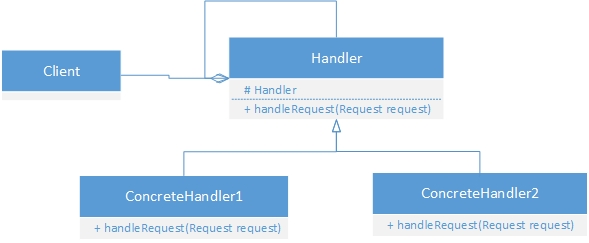
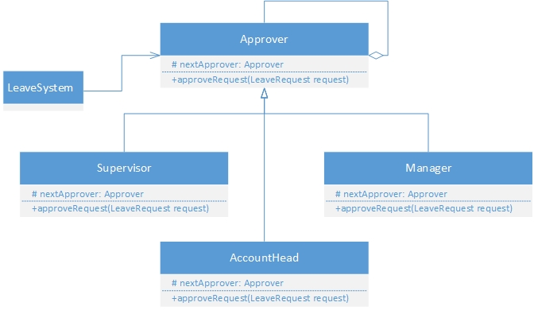

Sometimes we may come across a situation where there should not be direct coupling between sender and receiver of a request. 
Consider scenario where sender of request does not have any knowledge about who is going to handle the request. 
Chain of responsibilities pattern implementation comes to rescue here.

Avoid coupling the sender of a request to its receiver by giving more than one object a chance to handle the request.
Chain the receiving objects and pass the request along the chain until an object handles it.

<kbd></kbd>

<kbd></kbd>
