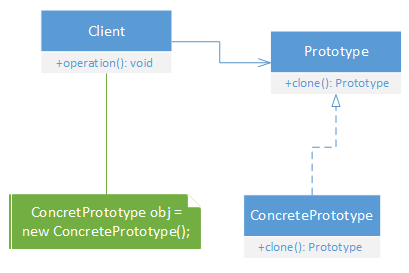

Prototype design pattern implementation allows us to solve the problem of having multiple copies of objects those are expensive and resource intensive to create.

Specifies kind of objects to created using prototypical instance and create new object by copying this object.

<kbd></kbd>
